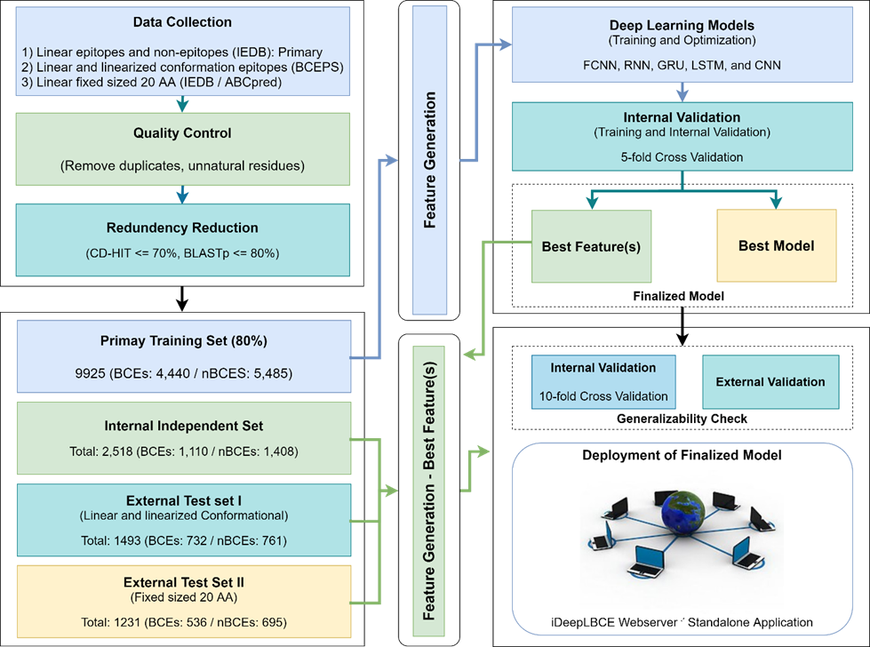
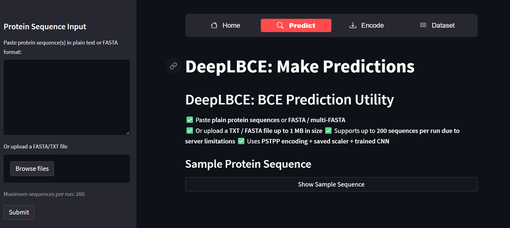
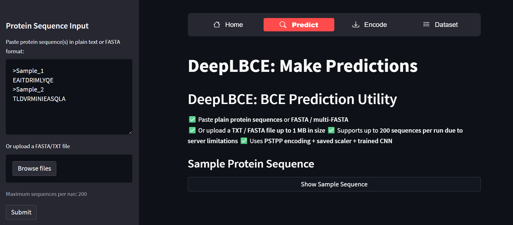
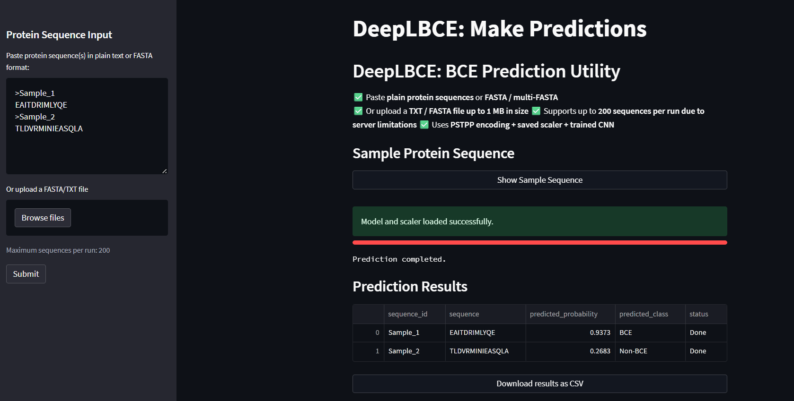
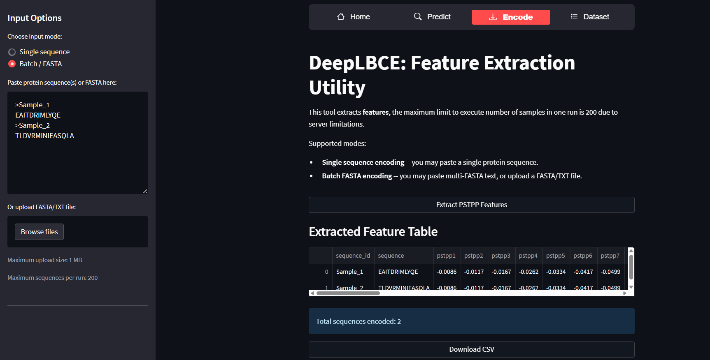
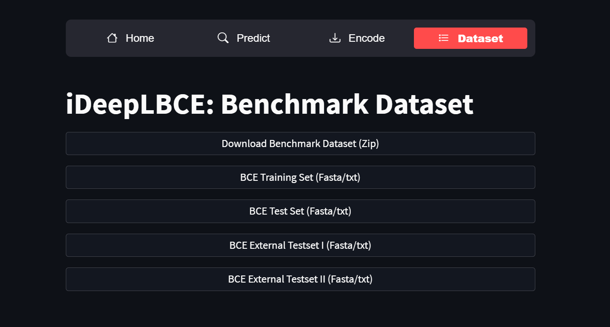

# iDeepLBCE
### iDeepLBCE: A Deep Learning-Based Web Server for Predicting Linear B-Cell Epitopes and Non-Epitopes.
#### iDeepLBCE is a web server built on a Deep Convolutional Neural Network (CNN) model developed to predict linear B-cell epitopes and non-epitopes from input protein sequence(s). The proposed model identifies potential B-cell epitopes with improved predictive accuracy, providing a reliable computational resource for immunoinformatics studies and epitope discovery.

### iDeepLBCE (online Predictor)
#### ON The basis of this proposed model a web based application has also been developed, which can be used for the identification of BCEs by providing a protein sequence. One can use ***Predict*** page for the prediction of BCEs or extract the same features (PSTPP) used in this study from the site by moving on the link ***Encode*** page. The link to the running model is https://ideeplbce.streamlit.app/. Benchmark datasets used in this study can be download as a whole in zip format or as individual files in fasta fomrat from  ***Dataset*** page.

### HM5C-Deep Workflow diagram

<!-- width="2500" height="1000" -->

# Help to use the online predictor
### Step 1: The free streamlit based web app sleeps after two days of no traffic. If so, click the blue button titled as "Yes, get this app back up!"

#### Step 2: Choose the Predict Page from the given menu to make predictions

<!-- width="1682" height="990" -->

#### Step 3: Paste any RNA sequence in the Input Area or upload a file and then press Submit

<!-- width="1678" height="897" -->

#### Step 4: Results will appear on the page, even you can download results in csv format

<!-- width="1678" height="682" -->

#### You can encode features by putting the sequences at Encode Page view and download features in csv format

<!-- width="1685" height="713" -->

#### Benchmark Dataset is also available at Dataset page 

<!-- width="1685" height="713"  -->

# Python version and libraries used in this study
### python==3.10.18
# requirements.txt
### tensorflow==2.10.0
### keras==2.10.0
### numpy==1.23.4
### pandas==1.5.1
### scikit_learn==1.1.3
### streamlit==1.20.0

